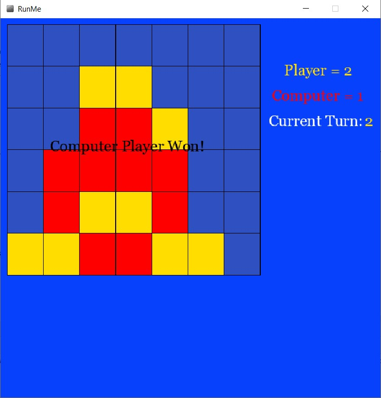

# Connect_4_GamePlaying_AI
A game playing AI for the Connect 4 game.

- Implements a *recursive function* to look at the *possibilities tree*

- Uses a *minimax function* with a *heuristic function* to determine the best move for the AI

Framework for display written by David Dobervich and is **NOT** included
